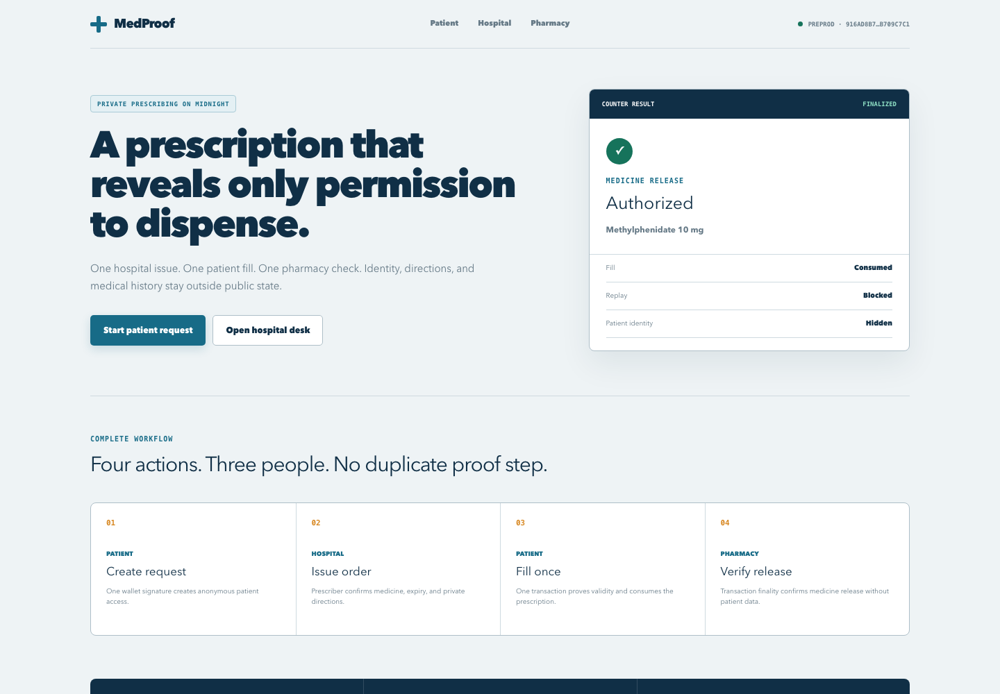
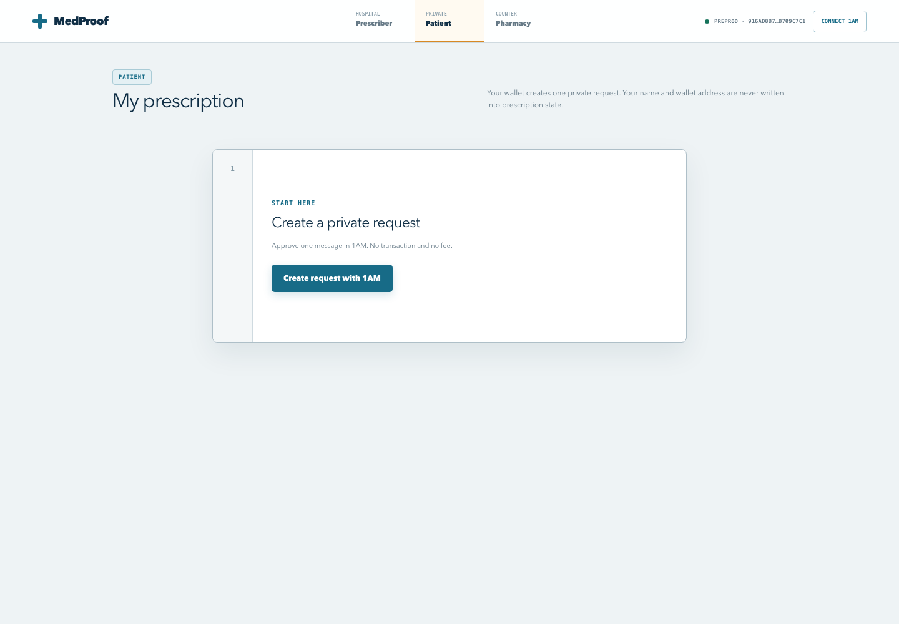
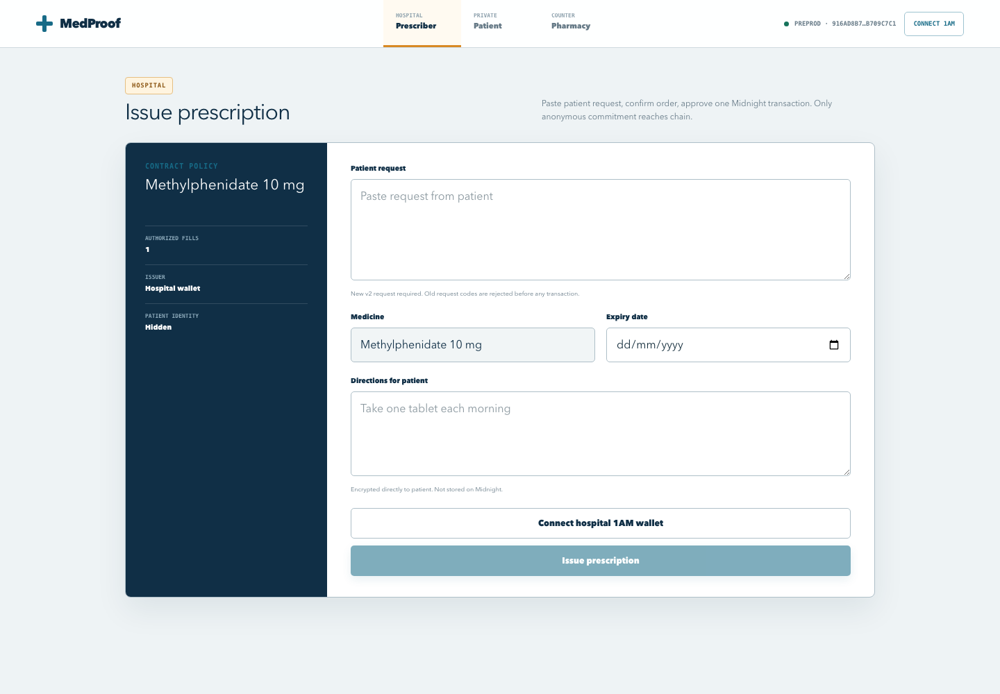
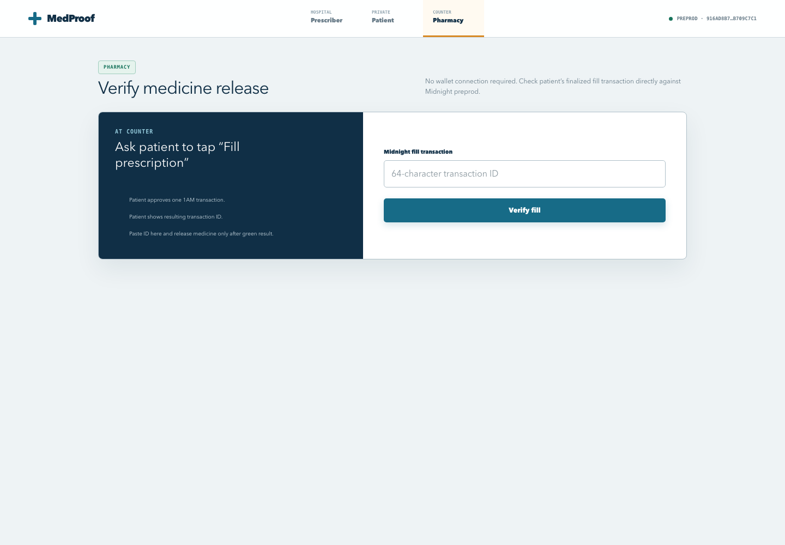
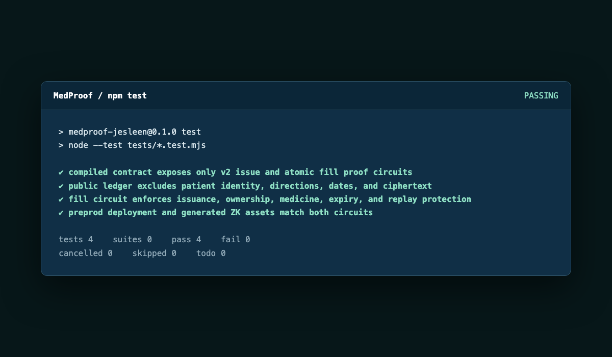

# MedProof

[](https://github.com/SuryanshSwarn101/MedProof/actions/workflows/ci.yml)
[](https://midnight.network/)
[](https://med-proof-phi.vercel.app/)

Private prescription credentials on Midnight. Hospital issues an anonymous commitment, patient proves ownership, and pharmacy verifies a finalized one-time fill. No simulated chain, dummy prescription, or server-controlled wallet.

## Live deployment

- Live dApp: [med-proof-phi.vercel.app](https://med-proof-phi.vercel.app/)
- Public repository: [github.com/SuryanshSwarn101/MedProof](https://github.com/SuryanshSwarn101/MedProof)
- Network: Midnight `preprod`
- Contract version: MedProof v2
- Contract address: `916ad8b74ead2c71bcfae68f63431ad2d8c5ececbf93e73be8f3f2f3b709c7c1`
- CI workflow: [`.github/workflows/ci.yml`](.github/workflows/ci.yml)
- Product X profile: [x.com/Medproof_](https://x.com/Medproof_)
- MVP demo video: [Watch on Google Drive](https://drive.google.com/file/d/1aLBJQPQeKt6wSrIvZx74HYKiMfbXBm6u/view?usp=sharing)
- Feedback form: [Submit feedback](https://forms.gle/2A4tLPNSSFQos79E8)
- Feedback responses: [View the spreadsheet](https://docs.google.com/spreadsheets/d/1YHq1RN4AvBvMVHUdhl5xSjDveUDxo0BTzei13aU8FX4/edit?usp=sharing)
- Test-output screenshot: [4/4 passing](docs/screenshots/medproof-tests.png)

## Contract Address

| Network | Address |
|---|---|
| Preprod | `916ad8b74ead2c71bcfae68f63431ad2d8c5ececbf93e73be8f3f2f3b709c7c1` |

## User Feedback Implementations

| Name | Email | Feedback | Solution | Fix Commit ID |
| --- | --- | --- | --- | --- |
| Ashish Singh | `singhashish7849@gmail.com` | The page could explain in simple words what happens after that action. | Added explicit explanation in patient wallet intro on post-reset secret generation behavior. | `df55972` |
| Priya Nair | `priyanair92@gmail.com` | I'd like to see more clarity around the overall user flow. | Added descriptive role tooltips (`Role: Hospital (Prescriber)`, etc.) to main navigation items. | `1e1f211` |
| Mayank Sengupta | `includemayank@gmail.com` | Would add a line clarifying exactly who can see the submitted details. | Added clear contract visibility note ("Patient only (Encrypted)") to hospital prescriber panel. | `37737fa` |
| Arjun Desai | `arjundesai7@gmail.com` | I suggest clarifying the workflow for adding new entries. | Clarified step 1 (paste request) and step 2 (confirm order & approve transaction) in doctor issue intro. | `693d94f` |
| Vikram Chauhan | `v.chauhan@gmail.com` | I suggest streamlining the flow for clearer step-by-step guidance. | Added explicit `Step 01` - `Step 04` badges to workflow cards on landing page. | `16ca53c` |
| Meera Iyer | `meera.iyer99@gmail.com` | Consider clarifying the user journey during the verification step. | Expanded fill action label to explain the specific ZK proof checks (issuance, ownership, expiry). | `f092cb4` |
| Aditi Bansal | `aditibansal19@gmail.com` | Was a bit unsure about which file types were best to upload. | Added placeholder and note specifying valid JSON prescription package formats generated by Midnight prescriber desk. | `106bb07` |
| Bipronil Ghosh | `bipronilg@gmail.com` | One of the input fields could show a sample so people know what format to use. | Added sample code format placeholder (`medproof:req:v2:...`) to patient request text box. | `75719e4` |
| Sanjeev Sharma | `sanjeevshakti@gmail.com` | Very quick to finish. On mobile, give the answer boxes a little more space. | Increased input & textarea touch padding to 13px 15px for improved mobile usability. | `b68b6e6` |
| SRINADH GHANTASALA | `2403031460778@paruluniversity.ac.in` | The form was clear and I didn't get stuck anywhere. A small thank-you message after submitting would be nice. | Added thank-you confirmation message to pharmacy verification completion screen. | `a412660` |

The live URL returned HTTP `200` when checked on 9 August 2026. On-chain operations require 1AM configured for Midnight preprod.

## Product screenshots

| Public landing | Patient wallet |
| --- | --- |
|  |  |

| Hospital prescriber | Pharmacy verification |
| --- | --- |
|  |  |

Screenshots show real deployed Vercel pages on Midnight preprod with no seeded patient or prescription records.

## Problem and approved-list category

Selected challenge idea: **Confidential Credentials**.

Paper prescriptions expose patient identity and medical details to every handler. They can also be copied or presented twice. MedProof turns a prescription into a confidential credential: hospital authorization and one-time use are verifiable, while patient identity and directions remain private.

Product proposal:

> Build a privacy-first prescription workflow where an authorized hospital issues a credential to a patient, the patient proves eligibility without revealing identity or directions, and a pharmacy verifies a finalized one-time fill directly from Midnight.

Full proposal: [`proposals.md`](proposals.md)

Idea approval evidence: **TODO — add approval/submission URL if challenge reviewer requires it.**

## Real user flow

1. Patient opens `/wallet`, connects 1AM, and approves one message signature.
2. App derives patient secret and commitment locally. Wallet address is not published.
3. Patient copies request code and gives it to prescriber.
4. Hospital opens `/doctor/issue`, connects authorized 1AM wallet, pastes request, enters expiry and directions, then submits `issuePrescription`.
5. Hospital gives returned encrypted prescription package to patient.
6. Patient imports package and selects **Fill prescription** at pharmacy counter.
7. `fillPrescription` proves issuance, ownership, medicine match, expiry, and unused status. Same transaction records one-time nullifier.
8. Pharmacy opens `/pharmacy`, pastes fill transaction ID, and verifies finalized action against Midnight indexer. Pharmacy wallet is not required.

No database or mock API decides validity. Midnight contract state and finalized transaction data are source of truth.

## Privacy model

### Observer can learn

- Contract address and version.
- Authorized hospital public commitment.
- Supported medicine hash.
- Anonymous prescription commitment insertion.
- Anonymous one-time fill nullifier.
- Transaction timing and public network metadata.

### Observer cannot learn

- Patient name, wallet address, secret, or delivery private key.
- Prescription directions or their plaintext.
- Link between patient identity and prescription commitment.
- Patient medication history from application state.
- Private witness values used by `fillPrescription`.

### Selective disclosure

Patient reveals only proof needed for fill: issued credential exists, belongs to current patient secret, matches configured medicine, remains unexpired, and has not been consumed. Directions use browser-side ECDH P-256 key agreement plus AES-GCM encryption. Only directions hash enters credential commitment; ciphertext travels hospital-to-patient and is not stored on-chain.

### Private-state boundary

Patient identity, imported credential, decrypted directions, and fill record remain in current browser session. App does not fake persistence with dummy records. Production recovery needs wallet-supported encrypted private-state backup; losing browser state currently means generating a new request.

## Contract design

Source: [`contract/MedProof.compact`](contract/MedProof.compact)

Two proof-producing circuits:

- `issuePrescription` — proves hospital authorization and inserts anonymous prescription commitment.
- `fillPrescription` — proves prescription validity and atomically inserts one-time nullifier.

Public ledger contains only:

- `doctorPk`
- `supportedDrugHash`
- `version`
- `prescriptions`
- `filledPrescriptions`

Atomic fill removes old two-transaction failure mode where proof could succeed while dispensing failed. Version check rejects stale contracts and old patient request codes.

## Architecture

```text
Patient 1AM ── signed request ──> browser commitment
                                      │ request code
                                      ▼
Hospital 1AM ── ZK issue proof ──> Midnight preprod contract
                                      │ encrypted package
                                      ▼
Patient browser ── ZK fill proof ─> atomic nullifier
                                      │ transaction ID
                                      ▼
Pharmacy browser ────────────────> Midnight indexer verification
```

Transaction pipeline:

```text
dApp builds unproven transaction
  → HTTP proof provider uses 1AM-configured ProofStation
  → 1AM balances/sponsors and submits transaction
  → app waits for Midnight indexer finality
```

## Local setup

Prerequisites:

- Node.js 22+
- npm
- [Compact CLI](https://github.com/midnightntwrk/compact) with toolchain `0.31.1`
- 1AM browser wallet on `preprod`
- Funded preprod NIGHT balance for hospital and patient transaction signing

Install and run:

```bash
git clone https://github.com/SuryanshSwarn101/MedProof.git
cd MedProof
npm ci
npm run compile
npm run sync:assets
npm run dev
```

Open [http://localhost:3000](http://localhost:3000).

Optional environment override:

```bash
NEXT_PUBLIC_MEDPROOF_CONTRACT_ADDRESS=<v2-preprod-address> npm run dev
```

For Vercel, set `NEXT_PUBLIC_MEDPROOF_CONTRACT_ADDRESS` to deployed v2 address and redeploy. Never use old v1 address with v2 generated assets.

## Deploy new contract

1. Temporarily start app without configured address.
2. Open `/deploy`.
3. Select `preprod` in 1AM and connect hospital wallet.
4. Select **Deploy MedProof v2** once.
5. Wait for indexer confirmation and copy returned address.
6. Set `NEXT_PUBLIC_MEDPROOF_CONTRACT_ADDRESS` locally and in Vercel.
7. Restart/redeploy, then create a new patient request.

Deployment wallet becomes authorized hospital issuer. Old contract and old request codes are intentionally rejected.

## Testing

Run:

```bash
npm test
```

Current suite contains four deterministic guardrail tests:

1. Compiled v2 circuit surface matches `issuePrescription` and `fillPrescription`.
2. Public ledger excludes private patient and prescription fields.
3. Fill circuit enforces issuance, ownership, medicine, expiry, and replay protection.
4. Preprod address plus proving/verifying assets match both compiled circuits.



Full verification:

```bash
npm run ci
```

This compiles Compact contract, refreshes ZK assets, runs tests, lints, and creates production Next.js build. GitHub Actions runs same stages on every push and pull request.

## Demo recording script

Use two browser profiles so hospital and patient wallets stay separate.

1. Show live URL, preprod network, and contract address.
2. Patient: connect 1AM, approve signature, copy request code.
3. Hospital: paste request, enter future expiry and directions, issue prescription.
4. Patient: import encrypted package and fill prescription.
5. Pharmacy: verify returned transaction ID.
6. Attempt same fill again; show replay protection.
7. End on GitHub Actions passing run.

## CI/CD

Workflow: [`.github/workflows/ci.yml`](.github/workflows/ci.yml)

Every push and pull request runs:

1. Dependency install with `npm ci`.
2. Compact CLI install and Compact `0.31.1` toolchain selection.
3. Contract compile and ZK asset sync.
4. Four tests.
5. ESLint.
6. Production Next.js build.

Vercel hosts frontend. Production deployment remains managed through connected Vercel project.

## Challenge submission evidence

### Level 3 — First Quarter

- [x] Provided-list idea selected: Confidential Credentials
- [x] Frontend wired to deployed Midnight contract
- [x] Meaningful privacy model
- [x] Four tests included
- [x] CI workflow included
- [x] Complete setup, usage, and privacy documentation
- [x] Public GitHub repository
- [x] Live demo
- [x] More than 10 meaningful commits (`26` at documentation time)
- [x] GitHub Actions CI passing
- [x] Test-output screenshot included
- [x] Demo video published

### Level 5 — Full Moon: Users & Feedback

- [x] Preprod demo link published: [med-proof-phi.vercel.app](https://med-proof-phi.vercel.app/)
- [x] Preprod contract address documented above
- [x] 50 wallet-address-bearing feedback responses collected
- [x] Wallet list recorded in [`USERS.md`](USERS.md) — 50 / 50
- [x] Feedback log, themes, and changes recorded in [`docs/FEEDBACK.md`](docs/FEEDBACK.md)
- [x] Ten feedback-driven improvements implemented and linked to commits
- [x] User guide available at [`docs/USAGE.md`](docs/USAGE.md)
- [x] Acquisition messages prepared below
- [x] More than 20 meaningful commits

#### User acquisition messages

**Discord / Telegram (under 100 words)**

> Help test MedProof on Midnight Preprod. It lets a hospital issue a private prescription credential, a patient prove ownership without exposing identity or directions, and a pharmacy verify a one-time fill. Install 1AM, switch to Preprod, open https://med-proof-phi.vercel.app/, connect your wallet, and try the flow. Reply with your Preprod wallet address after testing so we can record participation. Do not share wallet secrets or real medical information.

**X post (under 280 characters)**

> Test MedProof on Midnight Preprod: private prescription credentials, ZK ownership proof, and one-time pharmacy verification. Install 1AM, try the live flow, and share your Preprod wallet address after testing. https://med-proof-phi.vercel.app/

**Direct DM template**

> Hi! I’m collecting real developer feedback for MedProof, a Midnight Preprod dApp for private prescription credentials. Please install 1AM, switch to Preprod, open https://med-proof-phi.vercel.app/, connect your wallet, and try the patient → hospital → pharmacy flow. Please use test data only. Afterward, send me your Preprod wallet address and one thing that was clear or confusing. Never send your seed phrase or private keys.

### Level 4 — Waxing Gibbous

- [x] MVP live on Midnight preprod
- [x] Verifiable contract address documented
- [x] README setup and usage docs
- [x] CI/CD workflow included
- [x] More than 15 meaningful commits (`26` at documentation time)
- [x] GitHub Actions CI passing
- [x] Product X profile published
- [x] MVP demo video published

Unchecked items need real external URLs or a passing remote run. They remain explicit to avoid fabricated submission evidence.

## Known limitations

- One configured medicine and one fill per prescription.
- Browser-session private state has no recovery layer yet.
- Hospital authorization belongs to deploying wallet; no rotation circuit yet.
- Pharmacy verifies transaction finality and contract action, not patient identity.

## Commands

```bash
npm run dev          # sync ZK assets and start local app
npm run compile      # compile Compact contract
npm run sync:assets  # copy generated proving assets to public directory
npm test             # run 4 tests
npm run lint         # run ESLint
npm run build        # production Next.js build
npm run ci           # compile, sync, test, lint, build
```

## License

No license file is currently included. Add one before inviting external reuse or contributions.
